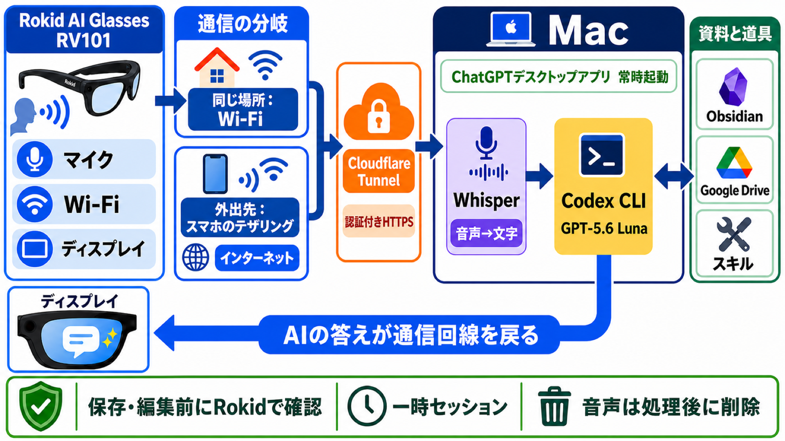

# Rokid Personal AI（私のAI）

Rokid AI Glassesは、マイクとディスプレイを備えたスマートグラスです。

「私のAI」は、Macでいつも使っているChatGPTデスクトップアプリを、Rokidから使えるようにしたものです。ChatGPTからは、Obsidianに保存したメモや資料、Google Driveにある文書も利用できます。

Rokidで話した内容はMacへ送られ、ChatGPTの答えがRokidのディスプレイに表示されます。前のやり取りを踏まえながら、そのまま会話を続けられます。

このリポジトリでは、実際に使っている仕組みから個人情報や接続情報を取り除き、同じようなものを自分で作りたい人が参考にできる部分を公開しています。完成品やインストーラーを配布するものではありません。

## できること

- RokidからChatGPTと日本語で会話する
- 前のやり取りを踏まえて会話を続ける
- Webや、Obsidianに保存したメモ・資料を調べる
- 会話とWebページのURLをObsidianに残す
- 内容を確認してから、Obsidianに文書を作成・編集し、Google Driveに文書を作成する
- スマートフォンのテザリングを使い、外出先から利用する

機能ごとのメニューを選ぶのではなく、やりたいことを話して頼みます。内容がはっきりしないときは、ChatGPTがRokidに聞き返します。

## 実際の使い方

1. Rokidに「Hi Rokid、私のAI」と話しかけます。
2. 「どうぞ」と表示されたら、Rokidのつるにある操作部分（テンプル）を1回タップして話します。
3. 話し終わったら、テンプルをもう一度タップします。
4. ChatGPTの答えがRokidに表示されます。
5. 続けて話すときは、「続けて話す」を選びます。
6. 終わるときは、テンプルをダブルタップします。

「私のAI」を開いただけでは録音は始まりません。「どうぞ」と表示されたあと、テンプルを1回タップすると録音が始まります。録音した音声は、文字に変換したあと削除します。

利用中は、Macの電源を入れ、ログインした状態でインターネットへ接続しておく必要があります。Macでは、ChatGPTデスクトップアプリと、Rokidからの呼びかけを受けるプログラムを動かしておきます。

Macへ接続できないときは、そのことをRokidに表示し、録音は始めません。

## システムの仕組み



図は全体の流れを示したものです。

Rokidは会話の入口として使い、音声の文字化、ChatGPTによる処理、会話の記録、文書の保存や編集はMac側で行います。ここからは、「私のAI」を呼び出してから終了するまでを順に説明します。

### 1. Rokidから「私のAI」を呼び出す

Rokidでは、声で呼び出して使う追加機能を「AIUI Agent」と呼びます。Agentは「AIUI Studio」という開発者向けの画面で登録し、その中で動くプログラムを「AIX」という形式で用意します。「私のAI」も、この仕組みを使ってRokidから呼び出します。

「Hi Rokid、私のAI」と呼びかけると、「どうぞ」の画面が開きます。画面表示、テンプルのタップ、マイク録音にはRokid側の機能を使います。

「私のAI」を呼び出すと、Rokidから、Macで待機している受付プログラムへ接続します。接続のたびに、その会話だけで使う新しい認証情報を発行し、会話が終わると無効にします。

終了時は、Macへ会話の終了を伝えて接続を閉じたあと、AIXの画面とRokidの音声呼び出し画面を閉じます。この終了処理にはRokid固有の実装が含まれるため、公開リポジトリには掲載していません。

### 2. Rokidで音声を収録する

Rokid AI Glasses RV101には、マイク、ディスプレイ、Wi-Fiがあります。Rokidで収録した音声をMacへ送り、Macから返ってきた答えをディスプレイに表示します。音声の文字化やChatGPTによる処理は、Rokidの中ではなくMacで行います。

### 3. RokidからMacへ安全に送る

Rokidは、Wi-Fiを使ってインターネットへ接続します。外出先では、スマートフォンのテザリングを使います。テザリングとは、スマートフォンの通信をRokidから利用する方法です。

Wi-Fiやテザリングは、Rokidをインターネットへ接続するためのものです。そこからMacまで安全に届ける経路には、Cloudflare Tunnelを使います。Cloudflare Tunnelは、自宅のMacをインターネットへ直接公開せず、認証されたHTTPS通信だけをMacへ届ける仕組みです。

この公開リポジトリでは、実際の通信先と認証情報を例示用の値へ置き換えています。同じ仕組みを作る場合は、自分の通信先と認証情報を用意する必要があります。

自宅ではWi-Fi、外出先ではスマートフォンのテザリングというように、場所に応じてRokidの接続先を切り替えます。その切り替えをRokid単体で行うために、別アプリの [Wi-Fi Selector](https://github.com/ksuzukigh/rokid-wifi-selector) を使います。Hi Rokidで設定した接続先のうち、現在使っているものと付近にある候補をRokidに表示し、切り替える接続先を選べます。

### 4. Macで音声を文字にする

Macでは、ChatGPTデスクトップアプリと、Rokidからの通信を受け取るプログラムを動かしておきます。

Whisperは、音声を文字に変換するAIです。この仕組みでは、WhisperをMac上で動かすために、whisper.cppというプログラムを使っています。

Whisperへ渡す前に、Silero VADで人の声が含まれているかを確認します。VADは、音声の中から発話部分を見つける仕組みです。これにより、何も話していないときにWhisperが文章を作ってしまうことを防ぎます。

録音した音声と、変換のために作った一時ファイルは、処理が終わると削除します。

### 5. ChatGPTが内容を処理する

文字にした発言は、ChatGPTデスクトップアプリに同梱されているCodex CLIへ渡します。Codex CLIは、会話の内容を読み、Webやファイル、接続したサービスを使って依頼を処理するための仕組みです。CodexのAIモデルには **GPT-5.6 Luna** を指定しています。

CodexからObsidianとGoogle Driveを利用できるようにしています。依頼に合うスキルがある場合は、そのスキルも使います。スキルとは、特定の作業に必要な手順や道具をまとめたものです。これは、この仕組みの作成者が使っている構成であり、すべてのChatGPTアカウントやAIモデルで同じ動作を確認したものではありません。

Rokidからの会話では、必要な接続と、許可した操作だけを使います。

Codexは、話した内容とそれまでの会話を読み、質問への回答、Web調査、Obsidianの検索、文書作成など、何を頼まれたのかを判断します。意味がはっきりしないときは、決めつけずにRokidへ聞き返します。

### 6. 答えをRokidへ返す

Codexが作った答えは、MacからRokidへ返し、ディスプレイに表示します。「続けて話す」を選ぶと、次の発言も同じCodexの会話へ渡すため、前のやり取りを踏まえて会話を続けられます。

終了のダブルタップをすると、進行中の録音や、まだ実行していない保存・編集を取り消します。そのあとMacへ会話の終了を伝え、接続と画面を閉じます。

### 7. 会話をObsidianへ記録する

Obsidianは、Markdown形式のメモや資料を保存・整理するアプリです。「私のAI」で交わした会話は、MacのObsidianへ日付ごとに記録します。

各記録には、次の内容を残します。

- 日本時間の時刻
- `私:`と`AI:`の発言
- 前の会話を参照したか
- 回答が完了したか、聞き返しの途中か
- 保存や編集を実行したか、取り消したか、失敗したか
- Webで調べたページのURL

Rokidの利用後にMacで会話を読み返し、紹介されたページを開いて確認できます。何を質問し、ChatGPTが何を答え、その後に何を保存・編集したかもたどれます。

この会話記録だけは、別の保存依頼をしなくても、決められたフォルダへ決められた形式で追記します。ChatGPTが保存先や書式を自由に選ぶことはできません。録音した音声は残しません。Obsidianへ記録した会話は自動では削除しないため、保管期間と削除は使う人が管理します。

### 8. 安全のための制限

「私のAI」はまだ初期版なので、安全を優先して使える範囲をかなり制限しています。外部からの不正な接続を防ぎ、ChatGPTが許可していない資料を読んだり、確認なしに保存・編集したりしないよう、次の制限をかけています。

**接続を守るための制限**

- 「私のAI」を使い始めたときだけMacとの接続を作り、終了したら閉じる
- 接続するたびに新しい秘密の値を使い、別の接続から届いた要求は受け付けない
- 受け取るデータの大きさ、待ち時間、同時に動かす接続数を制限する

**ChatGPTが利用できる範囲の制限**

- 会話部分は、決められた会話記録への追記を除いて読み取り専用で動かし、自由にファイルを書き換えさせない
- 会話記録は、決められたフォルダへ決められた形式で追記し、ChatGPTに保存先や書式を選ばせない

**保存や編集を実行するための制限**

- 保存や編集は、対象と内容をRokidに表示し、確認のためにテンプルをもう1回タップした後だけ実行する
- 現在許可している変更は、Obsidianへの新規文書作成、既存文書の一箇所編集、指定フォルダへのGoogleドキュメント作成に限る
- 送信、公開、共有、削除、移動、購入、予定登録などは、Rokidから自由に実行できない

日付別の会話記録への自動追記を除き、ChatGPTが勝手に文書を作ったり、書き換えたりすることはありません。

たとえば「この内容をObsidianへ保存して」と頼むと、Rokidに保存先、文書の題名、保存する本文を表示します。この時点では、まだ保存していません。

表示した内容を確認してテンプルをタップしたときだけ、その文書を作ります。取り消した場合、確認できる時間を過ぎた場合、確認後に本文や保存先が変わった場合は、何も変更しません。

既存文書の編集やGoogleドキュメントの作成も、同じ確認を通してから実行します。

実際に使いながら問題がないことを確かめ、必要なところから少しずつ制限を緩めていく予定です。

## このリポジトリだけでは動きません

このリポジトリは、完成したアプリを配布するためのものではありません。「私のAI」の構成と、安全に動かすための考え方を、自分の環境で再現するための参考資料です。

実際の利用環境から、個人情報や公開できない設定を取り除いています。このリポジトリには、次のものを入れていません。

- インストーラー
- インストール用APK
- 実際に使っている「私のAI」のプログラムと登録設定
- Rokid固有の終了処理と、そのための権限設定
- 実際に使っている通信先や認証情報
- ObsidianとGoogle Driveの実データ
- 録音、会話記録、実機画像
- 実際に使っているMacに合わせたパスや個人設定

同じ仕組みを動かすには、Rokid、Mac、通信経路、保存先を自分の環境に合わせて組み直し、自分で検証する必要があります。ダウンロードして、そのまま使えるものではありません。

この仕組みは、使う人ごとに資料、保存先、許可する操作が違います。そのため、共通のインストーラーは用意せず、設計とコードだけを公開しています。

## 自分で作ってみたい方へ

ここからは、この仕組みを自分の環境で再現する開発者向けの説明です。

再現には、少なくとも次の環境と作業が必要です。

- Hi Rokidで開発者モード（ADB）を有効にしたRokid AI Glasses RV101
- Rokid開発用5ピンUSBケーブル（初回のアプリ導入と動作確認に使用。付属の3ピンUSBケーブルは充電用のため、Macとの接続には使えません）
- macOSを搭載したMac
- Node.jsとAndroidの開発環境
- ChatGPTデスクトップアプリと、ChatGPTへログイン済みのCodex CLI
- Macで動かすWhisperとSilero VAD
- Cloudflare Tunnelなど、自分で管理するHTTPS通信経路
- 自分のObsidian保管庫と、必要に応じてGoogle Driveやスキルを使うための設定
- 通信先、保存先、許可する操作を自分で決める作業

この音声呼び出し方式を再現するには、公開コードのMac側を自分の環境へ合わせるだけでなく、AIUI Studioで自分用の「私のAI」を登録し、必要な端末内処理を自分の責任で設計・検証する必要があります。公開リポジトリだけから、実際に使っているものをそのまま作ることはできません。

開発初期には、Rokidのアプリ一覧から開くAndroid版も短期間使いました。そのAndroid起動役と一時AIXのコードは、RokidとMacの開始・終了処理を確認するための参考実装として残しています。本仕様の音声呼び出しとは異なります。

具体的に置き換える箇所は [自分の環境へ合わせるための説明](docs/ADAPTATION.md) にまとめています。

公開コードは、Android開発とRokidの開発環境、実機検証ができる方を前提にしています。動作保証や個別のセットアップサポートはありません。コードを読むだけでなく、自分の環境で安全性を確認してから使ってください。

## 主なフォルダ

- `daily-launcher-android/` — 開発初期の短期間だけ使ったAndroid起動役。端末とMacの開始・終了連携を読むための参考実装
- `daily-gateway/` — 会話、録音、Web・Obsidianの参照、保存前の確認をまとめる中心部分
- `mac-companion/` — Macのログイン後に、Rokidからの開始要求を待つ部分
- `aiui-knowledge-bridge/` — Rokidの画面、音声、Macとの受け渡しを扱う参考実装。実際に使っている「私のAI」のプログラムは含まない
- `knowledge-router/` — Obsidianから必要な文書を探し、回答へ渡す部分
- `action-candidate/` — 保存・編集前の確認と、確認した内容だけを1回実行するための共通部品

Mac側の会話処理と接続管理は、主に`daily-gateway/`と`mac-companion/`にあります。`aiui-knowledge-bridge/`には、RokidとMacの受け渡しを理解するための参考実装があります。実際に使っている「私のAI」と端末内の終了処理は、非公開の環境で管理しています。

主な節目は [CHANGELOG](CHANGELOG.md) で確認できます。

## 開発者向けの確認

Mac側の自動検査は、リポジトリの最上位で実行します。

```sh
npm test
npm run check
```

Android側の確認には、JDK 17、Android SDK 35、Gradleが必要です。Gradle wrapperと署名済みAPKは含めていません。

## ライセンス

[MIT License](LICENSE)
