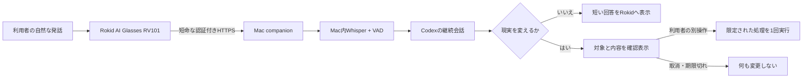

# Rokid Personal AI（私のAI）

Rokid AI Glasses RV101を、Mac上の個人AIと自然な音声でつなぐ参考実装です。

> [!IMPORTANT]
> これはインストールしてすぐ使える一般向けアプリではありません。実機で動作した個人用システムを、経験のある開発者が設計やコードの参考にできる形で公開しています。インストーラー、APKのRelease配布、セットアップサポート、動作保証はありません。

この公開リポジトリは、実働中の個人環境とGit履歴を分離したスナップショットです。認証情報、実際の通信先、Obsidian本文、Google Drive文書、会話記録、録音、生成AIX、実機画像は含みません。

## 目指した体験

利用者は「質問」「依頼」「説明」を選び分けず、Rokidへ自然に話します。AIは情報が足りなければ聞き返し、次の発言を同じ会話へ戻します。

読み取りや思考は固定メニューで狭めません。一方、保存・編集など現実を変える処理は、正確な対象と内容をRokidへ表示し、利用者が別の1回操作で確認した後だけ実行します。



## 実機で確認できたこと

検証機は **Rokid AI Glasses RV101（YodaOS、ADB名 `RG-glasses`）**、MacはApple Siliconです。

- アプリ一覧の「私のAI」から開始し、RV101マイクの音声をMacで文字化
- 同じ起動中に直前の会話を踏まえて自然に聞き返し・応答
- 完全無音をSilero VADで除外し、Whisperの無音由来の余分な定型句を抑制
- 読み取り専用のWeb調査と、許可したObsidian抜粋に基づく回答
- Obsidianへの新規Markdown作成と、既存文書の一箇所編集
- Google Drive固定フォルダへの新規Googleドキュメント作成
- 候補表示後の取消、期限切れ、二重確認、対象変更を無変更で拒否
- スマートフォンのテザリング経由で、自宅Macまでの二往復
- 終了後に原音、一時WAV、一時AIX、一時受け口を残さない後片付け

詳しい合格範囲と未確認事項は [検証結果](docs/VALIDATION.md) に分けて記載しています。

## そのまま使えない理由

この仕組みは、次の個人環境にまたがります。

- RV101のYodaOSとAIUI/AIX
- macOS上のNode.js、Codex CLI、ローカルWhisper
- 利用者自身の認証済みHTTPS経路
- 利用者自身のObsidian保管庫とGoogle Drive
- 利用者ごとに異なる保存先、安全境界、許可範囲

公開コードの通信先とパスは例示値に置き換えています。再現する場合は [環境への適合事項](docs/ADAPTATION.md) を読み、自分の環境に合わせて設計・変更・検証してください。

## 現在の構成

- `daily-launcher-android/` — RV101のアプリ一覧から開くAndroid起動役
- `daily-gateway/` — 継続会話、音声セッション、確認境界、Obsidian・Google Docsの限定処理
- `aiui-knowledge-bridge/` — AIUI/AIX、音声受け口、ローカル文字起こし、回答表示
- `knowledge-router/` — Obsidianの許可抜粋から根拠付き回答を作る読み取り専用部品
- `action-candidate/` — 未実行候補、一回確認、取消、期限切れを扱った段階的な実証
- `mac-companion/` — Macログイン時に開始口だけを待ち受けるLaunchAgent生成
- `daily-app/` — 初期段階のAIUI入口。現在の設計へ至る履歴として保持

現在の中心経路は `daily-launcher-android/`、`daily-gateway/`、`mac-companion/` です。それ以外には、設計を小さく検証しながら発展させたコードも含まれます。

## 検査

Node.js側は外部パッケージなしで動く検査を中心にしています。

```sh
npm test
npm run check
```

Android起動役はJDK 17、Android SDK 35、Gradleが必要です。Gradle wrapperと署名済みAPKは含めていません。

## 公開方針

- 一般利用者向けReleaseやインストーラーは作りません。
- 実働環境の認証情報、個人データ、通信先、録音、会話は公開しません。
- この公開版だけを根拠に、別環境で同じ動作を保証しません。
- 実機で確認した事実と、再現者が自分で検証すべき範囲を分けます。

このスナップショットは、非公開で実機検証した `v0.24.1` 相当の設計とソースを基にしています。Android起動役自体は `0.23.1` で、`v0.24.x` の主な変更はMac側です。公開リポジトリには過去の非公開タグやRelease配布物を移していません。

## ライセンス

[MIT License](LICENSE)
